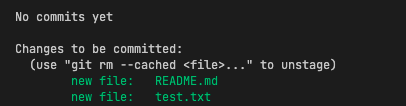
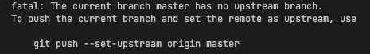
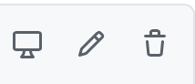

# Git Gud

So you've heard of `git` but don't know what it is or how to use it?\
Good thing for you, because you are at the right spot to learn everything you need.

_Disclaimer: This was made for the [Suited Llama Discord Server](https://discord.gg/fgbkwpg9Nw) to help the people there with sharing mods etc.,
    but it covers most common git stuff so it might be worth a read nonetheless._

Check out translated Versions:

## What is git?

>  Git is software for tracking changes in any set of files, usually used for coordinating work among programmers collaboratively developing source code during software development. Its goals include speed, data integrity, and support for distributed, non-linear workflows (thousands of parallel branches running on different systems)\
 <cite>[Wikipedia Git][1]</cite>

If you would need to explain it to someone who has no clue about any of that, I would say:
> Git is a tool for tracking changes in files and really great for team projects.

There are many different websites that offer servers (for free and paid versions) 
    where you can upload your `repositories` aka. your folders and maintain a project.

Some examples:
- [GitHub](https://github.com)
- [GitLab](https://about.gitlab.com)
- [Bitbucket](https://bitbucket.org/product)

But it is also possible to run your own git server on a RaspberryPi for example.

## Where can you get git?
Git is an open source software and distributed under the [GNU General Public License Version 2](https://en.wikipedia.org/wiki/GNU_General_Public_License#Version_2) <cite>([Wikipedia Git][1]</cite>).\
So you don't have to pay for anything.

Linux and Mac often come with a preinstalled version of git. If you're on windows it is possible that you need to download and install git first.
    [See this link for further instructions and the download.](https://git-scm.com/download/win)\
There are GUI clients but I'll not cover those.

## So how do we use git now?

In this guide we will only cover the usage via the Terminal/Console and vscode/IntelliJ.

Why the latter? Because many people on the [Suited Llama Discord](https://discord.gg/fgbkwpg9Nw) are using these programs to make awesome Minecraft mods.

# Terminal/Console

For the purpose of this guide we will create a useless folder with some useless files and upload it to GitHub.
    Then apply local changes to the contents of this folder and update our repository.
    Then apply changes inside the GitHub repository and pull them onto your device.
    Finally create a new branch and push this branch too.

Lets get started:

1. Create a new folder and name it whatever you want, just make sure there are no spaces
and only consists of letters from `a to z` and `1 to 9`. `_ -` are allowed too.

2. Open your terminal or your console.
    
    2.1. Windows: To do that on Windows search for a programm thats called `Command Prompt` and open it,
    if you are unable to find it please refer to [this guide](https://www.howtogeek.com/235101/10-ways-to-open-the-command-prompt-in-windows-10/) or [this guide](https://towardsdatascience.com/a-quick-guide-to-using-command-line-terminal-96815b97b955).
    
    2.2. Linux: Press `ctrl+alt+T` if that doesn't do the trick please refer to [this guide](https://towardsdatascience.com/a-quick-guide-to-using-command-line-terminal-96815b97b955).

    2.3. MacOS: To open the Terminal on MacOS press `cmd+space` and enter `Terminal`press `Enter` again and a new window will show up.
    If this wont work please refer to [this guide](https://towardsdatascience.com/a-quick-guide-to-using-command-line-terminal-96815b97b955).

3. Your Terminal won't be in the correct directory (so not in the folder you created in step 1).
To change this type in: `cd path/to/your/folder`.\
`cd` stands for `change directory`. 

    3.1 MacOS: You can get the path to your folder by rightcklicking on your folder and holding `alt`.
    You can now select `copy path` (or similar). You can enter the path with pressing `cmd+v`.

    3.2. Windows: Navigate to your folder. On top of the window is a adress bar. You can click in this and copy the whole folder path.
    If you have trouble follow [this guide](https://www.sony.com/electronics/support/articles/00015251).

    3.3. Linux: You're most likely already using the console for other purposes so I assume you know how to do it.\
    (I must also admit, that I've never used a gui linux system and have no clue how those work, sorry!)

4. Now you are in the correct spot and need to initialize a repository. To do this enter `git init` .\
This command will create a hidden `.git` folder. You can make sure its there by entering `ls .git` or `dir .git` on Windows.\
`ls` stands for list and dir.. (directory maybe?) however, they produce the same outcome and list all files and folder inside the `.git` folder.

This folder handles all your git related stuff, like what server your using and what your username is etc.

5. You now need to add a `remote` to your git repository. 
A remote is basically the adress to which you are uploading and downloading the files.
We need to do a few other things first:

    5.1. Go to [GitHub](https://github.com) and Sign in (or create an account).

    5.2 On the left side you see a tab called `Repositories` next to it is a button called `New`.
    Click on that to create a new Repository.\
    Choose a name and decide if you want to make it public or private.\
    Leave the rest as is, I'll cover those later.

    5.3 You have now created an empty repository on GitHub!\
    Copy the link to this website. Sadly this wont work in the future due to security reasons, you need to add an SSH key
    and the remotes via SSH. I'll not cover this in this guide.\
    My link looks like this: https://github.com/rlDruDo/tets .

    5.4 Now go back into the terminal. Enter `git remote add origin https://github.com/rlDruDo/tets` but change my link to your link.\
    This command creates a new remote called origin that points to your link. Its for up- and downloading.

    5.5 Make sure it worked by entering `git remote -v` and see if your link is listed for `fetch` and `push`.

6. Next create some random files inside your folder.
Preferably with an existing file format.
Create at least one .txt or .md file.

7. Now we want to upload the contents of our folder.
Uploading takes several steps:

First we add our files (we don't need to add all files all the time, but for the purpose of this guide we will do so).
Then we commit those files and
finally you push these files.

To commit the changes (changed files) you enter `git add .` (Yes with the dot.) 
The dot indicates that you want to add all files, if you don't want that, enter each file individually separated by spaces.

After you added all your files you can check if it worked by entering `git status`\
This commands prints your the status of your git repository.
This is how mine looks:\

Now we need to commit the files with a commit message, to do so enter `git commit -m "Your Commit Message"`\
The commit message should be a **quick** summary of your changes.
You might want to consider using [gitmoji](https://gitmoji.dev).

Finally you can upload your files using `git push`\
If you're getting an error message like this:\

Then enter the command shown aka `git push --set-upstream origin master`

Great! Now you can create a GitHub repository as well as upload your files to it. But...

## ... how about downloading changes that my teampartner made?

Easy.

1. Go to your GitHub Repository.
2. Then click `Add file > Create New File`
Name it something.txt or something.md and add some random lines

You could also add the test file created earlier by clicking on this file and then clicking the pencil on the right hand side. The one in the middle here:\

3. Now go to the bottom of the page and press `Commit Changes`

Now you simulated a change from a team member. 

4. Go back to your console and enter `git pull`\
You'll notice that something happened, if you list the contents of your folder you'll see that the new file is here,
as well as the changes you made to your test file.

## Okay but what about downloading an existing repository?

As well: Easy.

Navigate to your desired folder and enter `git clone link`\
E.g. `git clone https://github.com/SuitedLlama/An-Edible-World`

You know have this repository installed.

# done (for now)

Those are the git basics. 
I'll update this guide to support branching and the usage of visual studio code and IntelliJ.
However you can do it in those programms just like I described above via the build in terminals.
(I do it like this)

Have a good week and stay healthy.

<!-- ## Sources -->
[1]: https://en.wikipedia.org/wiki/Git