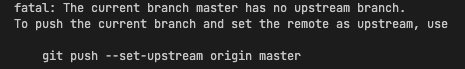

# Git Gud

Sie haben also schon von `Git `gehört, wissen aber nicht, was es ist
oder wie man es benutzt?\
Gut für Sie, denn Sie sind an der richtigen Stelle, um alles zu lernen,
was Sie brauchen.

*Disclaimer: Dies wurde für den* [*Suited Llama Discord
Server*](https://discord.gg/fgbkwpg9Nw) *gemacht, um den Leuten dort
beim Austausch von Mods etc. zu helfen, aber es deckt die meisten
gängigen Git-Sachen ab, so dass es trotzdem lesenswert sein könnte.*

Sehen Sie sich die übersetzten Versionen an:

- [English](https://github.com/rlDruDo/gittut)
- [Ελληνικά](https://github.com/rlDruDo/gittut/blob/master/README_Greek.md)
- [Español](https://github.com/rlDruDo/gittut/blob/master/README_spanish.md)

## Was ist Git?

> Git ist eine freie Software zur verteilten Versionsverwaltung von Dateien, die durch Linus Torvalds initiiert wurde.\
> [Wikipedia Git](https://de.wikipedia.org/wiki/Git)

Wenn Ich es jemandem erklären müsste, der von all dem keine Ahnung hat,
würde ich sagen: 
> Git ist ein Werkzeug zum Verfolgen von Änderungen in
Dateien und wirklich großartig für Team-Projekte.

Es gibt viele verschiedene Websites, die Server (kostenlose und
kostenpflichtige Anbieter) anbieten, auf die Sie Ihre
`Repositories `aka. Ihre Ordner hochladen und ein Projekt verwalten
können.

Einige Beispiele: 
- [GitHub](https://github.com) 
- [GitLab](https://about.gitlab.com) 
- [Bitbucket](https://bitbucket.org/product)

Es ist aber auch möglich, einen eigenen Git-Server zum Beispiel auf
einem RaspberryPi zu betreiben.

## Wo kann man Git bekommen?

Git ist eine Open-Source-Software und wird unter der [GNU General Public
License Version
2](https://en.wikipedia.org/wiki/GNU_General_Public_License#Version_2)
([Wikipedia Git](https://en.wikipedia.org/wiki/Git)) vertrieben.\
Sie müssen also für nichts bezahlen.

Linux und Mac werden oft mit einer vorinstallierten Version von git
geliefert. Wenn Sie unter Windows arbeiten, ist es möglich, dass Sie git
zuerst herunterladen und installieren müssen. [Unter diesem Link finden
Sie weitere Anweisungen und den
Download.](https://git-scm.com/download/win)\
Es gibt auch GUI-Clients, aber auf diese gehe ich nicht ein.

## Wie verwenden wir nun Git?

In dieser Anleitung wird nur die Verwendung über das Terminal/Konsole
und vscode/IntelliJ behandelt.

Warum letzteres? Weil viele Leute auf dem [Suited Llama
Discord](https://discord.gg/fgbkwpg9Nw) diese Programme benutzen, um
tolle Minecraft-Mods zu machen.

# Terminal/Konsole

Für den Zweck dieser Anleitung werden wir einen nutzlosen Ordner mit
einigen nutzlosen Dateien erstellen und ihn auf GitHub hochladen. Wenden dann lokale Änderungen an den Inhalten dieses Ordners an und
aktualisieren unser Repository. Wenden dann Änderungen im
GitHub-Repository an und pushen diese auf Ihr Gerät. Zum Schluss
erstellen Sie einen neuen Zweig (Branch) und pushen auch diesen Zweig.

Fangen wir an:

1.  Erstellen Sie einen neuen Ordner und benennen Sie ihn nach Belieben,
    achten Sie nur darauf, dass er keine Leerzeichen enthält und nur aus
    Buchstaben von `a bis z `und `1 bis 9 `besteht. Auch `_ - `sind
    erlaubt.

2.  Öffnen Sie Ihr Terminal oder Ihre Konsole.

-   2.1. Windows: Suchen Sie dazu unter Windows nach einem Programm
    namens `Eingabeaufforderung `und öffnen Sie es, wenn Sie es nicht
    finden können, lesen Sie bitte [diese
    Anleitung](https://www.howtogeek.com/235101/10-ways-to-open-the-command-prompt-in-windows-10/)
    oder [diese
    Anleitung](https://towardsdatascience.com/a-quick-guide-to-using-command-line-terminal-96815b97b955).

    2.2. Linux: Drücken Sie `ctrl+alt+T`. Wenn das nicht hilft, lesen
    Sie bitte [diese
    Anleitung](https://towardsdatascience.com/a-quick-guide-to-using-command-line-terminal-96815b97b955).

    2.3. MacOS: Um das Terminal unter MacOS zu öffnen, drücken Sie
    `cmd+Leertaste `und geben Sie `Terminal` ein Drücken Sie erneut
    `die Eingabetaste `und ein neues Fenster wird angezeigt. Wenn dies
    nicht funktioniert, lesen Sie bitte [diese
    Anleitung](https://towardsdatascience.com/a-quick-guide-to-using-command-line-terminal-96815b97b955).

3.  Ihr Terminal befindet sich nicht im richtigen Verzeichnis (also
    nicht in dem Ordner, den Sie in Schritt 1 erstellt haben). Um dies
    zu ändern, geben Sie ein: `cd path/to/your/folder`.\
    `cd `steht für `change directory`.

    3.1 MacOS: Sie können den Pfad zu Ihrem Ordner erhalten, indem Sie
    mit der rechten Maustaste auf Ihren Ordner klicken und
    `alt `gedrückt halten. Sie können nun `Pfad kopieren `(oder ähnlich)
    wählen. Mit der Tastenkombination `cmd+v `können Sie den Pfad
    eingeben.

    3.2. Windows: Navigieren Sie zu Ihrem Ordner. Am oberen Rand des
    Fensters befindet sich eine Adressleiste. Sie können in diese
    klicken und den gesamten Ordnerpfad kopieren. Wenn Sie Probleme
    haben, folgen Sie [dieser
    Anleitung](https://www.sony.com/electronics/support/articles/00015251).

    3.3. Linux: Wahrscheinlich benutzen Sie die Konsole schon für andere
    Zwecke, also nehme ich an, dass Sie wissen, wie es geht.\
    (Ich muss auch zugeben, dass ich noch nie ein Gui-Linux-System
    benutzt habe und keine Ahnung habe, wie diese funktionieren, sorry!)

4.  Jetzt sind Sie an der richtigen Stelle und müssen ein Repository
    initialisieren. Geben Sie dazu `git init `ein.\
    Mit diesem Befehl wird ein versteckter `.`git-Ordner angelegt. Sie
    können sich vergewissern, dass er vorhanden ist, indem Sie
    `ls .git `oder `dir .git `unter Windows eingeben.\
    `ls `steht für list und dir.. (directory vielleicht?), führen aber
    zum gleichen Ergebnis und listen alle Dateien und Ordner im
    `.git`-Ordner auf.

In diesem Ordner werden alle Git-relevanten Informationen abgelegt, z.
B. welcher Server verwendet wird, welcher Benutzername verwendet wird
usw.

5.  Sie müssen nun Ihrem Git-Repository ein `Remote `hinzufügen. Ein
    Remote ist im Grunde die Adresse, an die Sie die Dateien hoch- und
    herunterladen. Wir müssen zuerst ein paar andere Dinge tun:

-   5.1. Gehen Sie zu [GitHub](https://github.com) und melden Sie sich
    an (oder erstellen Sie ein Konto).

    5.2 Auf der linken Seite sehen Sie eine Registerkarte namens
    `Repositories`, daneben befindet sich eine Schaltfläche namens
    `New`. Klicken Sie darauf, um ein neues Repository zu erstellen.\
    Wählen Sie einen Namen und entscheiden Sie, ob Sie es öffentlich
    oder privat erstellen wollen.\
    Lassen Sie den Rest so, wie er ist, ich werde das später behandeln.

    5.3 Sie haben nun ein leeres Repository auf GitHub erstellt!\
    Kopieren Sie den Link zu dieser Website. Leider wird dies aus
    Sicherheitsgründen nicht mehr funktionieren, Sie müssen einen
    SSH-Schlüssel und die Remotes über SSH hinzufügen. Das werde ich in
    dieser Anleitung nicht behandeln.\
    Mein Link sieht wie folgt aus: https://github.com/rlDruDo/tets .

    5.4 Gehen Sie nun zurück in das Terminal. Geben Sie
    `git remote add origin https://github.com/rlDruDo/tets `ein, aber
    ändern Sie meinen Link in Ihren Link.\
    Dieser Befehl erstellt eine neue Remote namens origin, die auf Ihren
    Link verweist. Sie dient zum Hoch- und Herunterladen.

    5.5 Vergewissern Sie sich, dass es funktioniert hat, indem Sie
    `git remote -v `eingeben und prüfen, ob Ihr Link für `fetch `und
    `push `aufgelistet ist.

6.  Erstellen Sie als nächstes einige beliebige Dateien in Ihrem Ordner.
    Vorzugsweise mit einem vorhandenen Dateiformat. Erstellen Sie
    mindestens eine .txt- oder .md-Datei.

7.  Nun wollen wir den Inhalt unseres Ordners hochladen. Das Hochladen
    erfolgt in mehreren Schritten:

Zuerst fügen wir unsere Dateien hinzu (wir müssen nicht immer alle
Dateien hinzufügen, aber für den Zweck dieser Anleitung werden wir das
tun). Dann committen wir diese Dateien und schließlich pushen Sie diese
Dateien.

Um die Änderungen (geänderte Dateien) zu übergeben, geben Sie
`git add .` ein. (Ja mit dem Punkt.) Der Punkt zeigt an, dass Sie alle
Dateien hinzufügen wollen, wenn Sie das nicht wollen, geben Sie jede
Datei einzeln durch Leerzeichen getrennt ein.

Nachdem Sie alle Dateien hinzugefügt haben, können Sie überprüfen, ob es
funktioniert hat, indem Sie `git status`\
Dieser Befehl gibt Ihnen den Status Ihres Git-Repositorys aus. So sieht
meines aus:\

Nun müssen wir die Dateien mit einer Commit-Nachricht übertragen. Geben
Sie dazu `git commit -m "Ihre Commit-Nachricht" `ein.\
Die Commit-Nachricht sollte eine **kurze** Zusammenfassung Ihrer
Änderungen sein. Vielleicht möchten Sie die Verwendung von [Gitmoji](https://gitmoji.dev) in Erwägung ziehen.

Schließlich können Sie Ihre Dateien mit `git push `hochladen\
Wenn Sie eine Fehlermeldung wie diese erhalten:\

Geben Sie dann den gezeigten Befehl aka
`git push --set-upstream origin master `ein

Großartig! Jetzt können Sie ein GitHub-Repository erstellen und Ihre
Dateien dorthin hochladen. Aber\...

## \... wie sieht es mit dem Herunterladen von Änderungen aus, die mein Teampartner vorgenommen hat?

Easy.

1.  Gehen Sie zu Ihrem GitHub-Repository.
2.  Klicken Sie dann auf
    `Datei hinzufügen > Neue Datei erstellen `Nennen Sie sie
    irgendwas.txt oder irgendwas.md und fügen Sie einige beliebige
    Zeilen hinzu

Sie können auch die zuvor erstellte Testdatei hinzufügen, indem Sie auf
diese Datei klicken und dann auf den Bleistift auf der rechten Seite
klicken. Der in der Mitte hier:\

3.  Gehen Sie nun zum Ende der Seite und drücken Sie auf
    `Commit Changes`

Nun haben Sie eine Änderung durch ein Teammitglied vorgetäuscht.

4.  Gehen Sie zurück zu Ihrer Konsole und geben Sie `git pull `ein\
    Sie werden feststellen, dass etwas passiert ist. Wenn Sie den Inhalt
    Ihres Ordners auflisten, werden Sie sehen, dass die neue Datei hier
    ist, ebenso wie die Änderungen, die Sie an Ihrer Testdatei
    vorgenommen haben.

## Okay, aber was ist mit dem Herunterladen eines vorhandenen Repositorys?

Und auch: Einfach.

Navigieren Sie zu dem gewünschten Ordner und geben Sie
`git clone link`ein\
Z. B. `git clone https://github.com/SuitedLlama/An-Edible-World`

Nun ist dieses Repository installiert.

# fertig (vorerst)

Das sind die Git-Grundlagen. Ich werde diese Anleitung aktualisieren, um
branching und die Verwendung von Visual Studio Code und IntelliJ zu
unterstützen. Sie können es jedoch in diesen Programmen genauso machen,
wie ich es oben über die Build-In-Terminals beschrieben habe. (Ich mache
es so)

Haben Sie eine gute Woche und bleiben Sie gesund.
